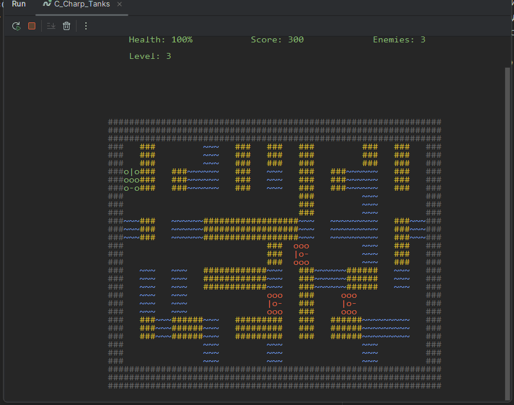

# 🏆 C# Tanks — Ретро-танки на C#


🚀 Простая, но захватывающая консольная игра в духе классических танковых баталий!

## 🎮 Описание проекта
"C# Tanks" — это игра, вдохновлённая классическими танковыми битвами, написанная на C# с использованием **консольной графики**.  
Игрок управляет танком, уничтожает врагов и старается выжить как можно дольше.

## 🎮 Геймплей
<p>🔸 Игрок управляет танком, передвигается по карте и уничтожает врагов <p>
<p>🔸 Враги патрулируют территорию и реагируют на игрока <p>
<p>🔸 Разрушаемые и неразрушаемые блоки создают стратегические возможности <p>
<p>🔸 Подсчёт очков за уничтоженных врагов <p>

 

## ✨ Функциональность
✅ Движение танков (игрока и врагов)  
✅ Стрельба и коллизии с объектами  
✅ Простейший AI противников  
✅ Разрушаемые блоки  
✅ Подсчёт очков  

## 🚀 Как запустить?
### 1. 📦 Скачай и установи .NET SDK  
Скачай с [официального сайта](https://dotnet.microsoft.com/en-us/download)  
(Проект использует **.NET 6+**, убедись, что он установлен!)

### 2. 📂 Клонируй репозиторий:
```sh
git clone https://github.com/vadimvatsenko/C_Charp_Tanks.git
cd C_Charp_Tanks
```
### 3. ▶ Запусти проект:
```sh
dotnet run
```

```sh
C_Charp_Tanks/
│── Blocks/         # Объекты окружения (декорации, стены)
│── Engine/         # Основной движок игры
│── Fabrics/        # Фабрики для создания объектов (юниты, пули)
│── Systems/        # Коллизии, физика, AI
│── Venicals/       # Классы танков (игрок, враги)
│── States/         # Система состояний игры (меню, игровой процесс)
│── Program.cs      # Точка входа
│── README.md       # Этот файл
```

## 🛠 Технологии
<p>📌 Язык: C# </p>
<p> 📌 Фреймворк: .NET 6 </p>
<p> 📌 Основные концепции: ООП, FSM (Finite State Machine), система событий </p>

## 🌟 TODO / Планы
<p> ✔ Улучшение AI врагов </p>
<p> ✔ Оптимизация коллизий </p>
<p> ❌ Добавить поддержку звука </p>
<p> ❌ Реализовать мультиплеер </p>

